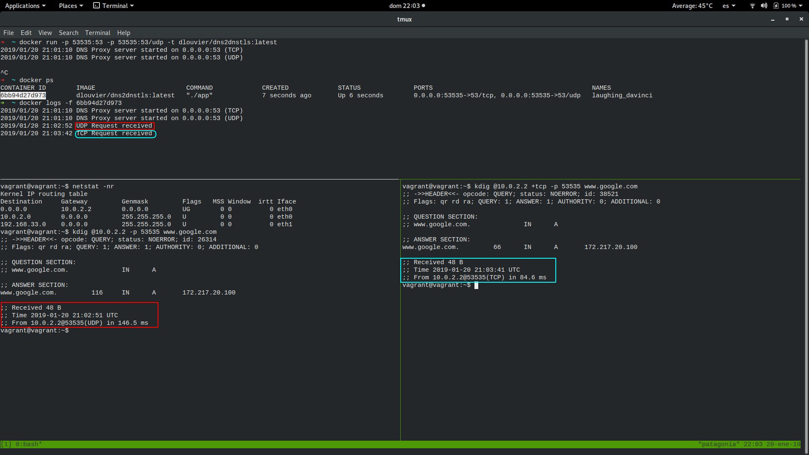

# dns2dnsTLS

dns2dnsTLS is a proxy to incoming UDP/TCP request to tunnel into a DNS TLS resolver written in Golang

# Use of case
The potential use of case of this proxy is a security improvement on the infrastructure. By the default, DNS works doing queries over 53/udp . This makes, even after work we use https, the initial negotiation to be transfered on plain text. This can cause too a possible man in the middle attackt spoffing our target server.

For this, DNS TLS was designed. DNS TLS uses TCP instead of UDP and create an secure channel for data transfer.

Most of the current applications queries DNS works in UDP and rewrite all of these applications could be very unnecessary work
With a proxy like this, it is possible to be deployed in a Kubernetes cluster easily and set as a default DNS resolver, so we don't need to rewrite all the application, setting it as default we will intercept all the DNS queries and resolver the external names securely.

### Resources
* [RFC1035](https://tools.ietf.org/html/rfc1035) - DNS Protocol specification
* [Cloudflare](https://developers.cloudflare.com/1.1.1.1/dns-over-tls/) - Cloudflare 1.1.1.1 service documentation
* [Rind](https://github.com/owlwalks/rind) - GitHub for a REST DNS server

### Installation

The application it is dockerized in a Docker image. Having docker alredy we can build the image as:

```sh
$ docker build . -t dns2dnstls
```
and run it as:
```sh
$ docker run -p 5353:53 -p 5353:53/udp -t dns2dnstls (you can use the already build image dlouvier/dns2dnstls:latest in docker hub)
```
This will bound your local port 5353 to the 53 which the application has already setup as a constant. If you wish to change this setup, you can edit the main.go file.

Please note you can run it on your local 53 too, but 1. you need to have root privileges and 2. ensure there is nothing already running there (you can check with lsof -i 53 )

### How to test it
Once the docker container is running on our local system we can use "kdig" to do queries. Find screenshoot below.

- For UDP Requests
```sh
$ kdig @127.0.0.1 -p 5353 www.google.com
```
- For TCP Requests
```sh
$ kdig @127.0.0.1 +tcp p 5353 www.google.com
```



### Todo

 - Enable a cache mode so not for every request need to query external resolver
 - Enhanced security only allowing correct certificates on the TLS channel
 - Allow to use multiple resolvers

License
----
GPLv3